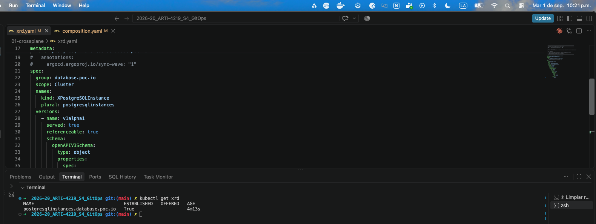
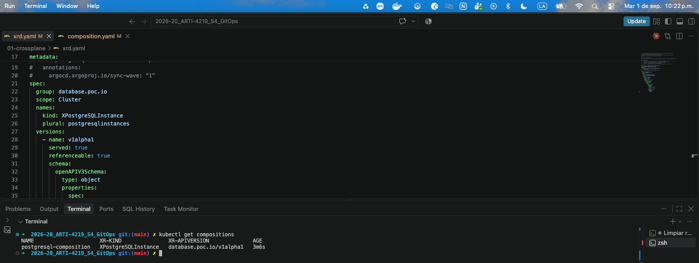
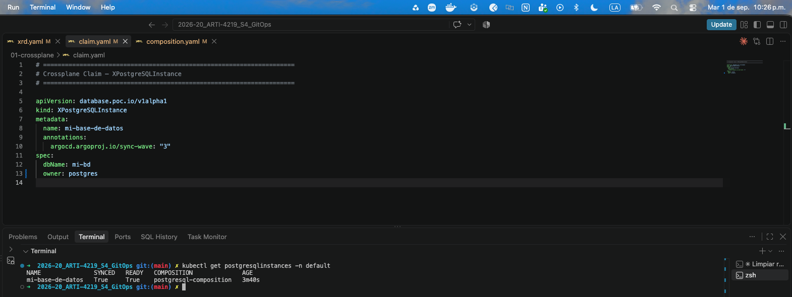
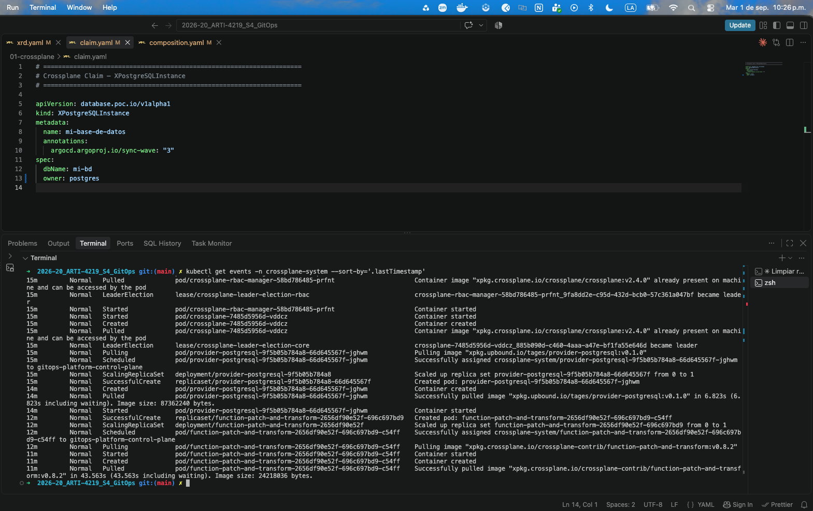

# Fase 1: Crossplane — Infraestructura como Datos en Kubernetes

## 1.1 ¿Qué es Crossplane?

Crossplane es un **operador de Kubernetes** de código abierto que extiende el API de Kubernetes para gestionar recursos de infraestructura externos (bases de datos, colas de mensajes, redes en la nube, etc.) de la misma manera que gestionamos Pods o Deployments.

La idea central es poderosa: **el plano de control de Kubernetes se convierte en el plano de control de toda tu infraestructura**.

### Conceptos clave que debes dominar:

| Concepto | Descripción |
| --- | --- |
| **Provider** | Plugin que sabe cómo hablar con un sistema externo (AWS, GCP, PostgreSQL) |
| **Managed Resource (MR)** | Representación 1:1 de un recurso externo en Kubernetes |
| **Composite Resource (XR)** | Agrupación de Managed Resources que forman una unidad lógica |
| **CompositeResourceDefinition (XRD)** | Define el esquema del XR y los Claims |
| **Claim** | Documento que invoca un XRD para obtener infraestructura |

### Referencias esenciales

- 📖 [Documentación oficial de Crossplane](https://docs.crossplane.io/latest/)
- 📖 [Conceptos: Composite Resources](https://docs.crossplane.io/v2.3/composition/composite-resources/)
- 📖 [Conceptos: Compositions](https://docs.crossplane.io/v2.3/composition/compositions/)
- 📖 [Provider PostgreSQL en Upbound Marketplace](https://marketplace.upbound.io/providers/tages/provider-postgresql/v0.1.0?tab=managedResources)

---

## 1.2 Instalación de Crossplane

### Paso 1: Crear el clúster Kind

```bash
# Crear un clúster Kind con nombre gitops-platform
kind create cluster --name gitops-platform

# Verificar que el contexto apunta al nuevo clúster
kubectl config current-context
# Debe mostrar: kind-gitops-platform
```

### Paso 2: Instalar Crossplane con Helm

```bash
# Agregar el repositorio de Helm de Crossplane
helm repo add crossplane-stable https://charts.crossplane.io/stable
helm repo update

# Instalar Crossplane en el namespace crossplane-system
helm install crossplane \
  crossplane-stable/crossplane \
  --namespace crossplane-system \
  --create-namespace \
  --wait

# Verificar la instalación
kubectl get pods -n crossplane-system
```

### Paso 3: Instalar el Provider de PostgreSQL

Un **Provider** es el **plugin** que le enseña a Crossplane cómo hablar con un sistema externo, en este caso, PostgreSQL.

| Qué hace | Detalle |
|---|---|
| **Se instala como un paquete OCI** | `package:` apunta a una imagen de contenedor en el registro de Upbound. Crossplane la descarga y la ejecuta como un Pod dentro del clúster. |
| **Registra nuevos tipos de recursos** | Una vez instalado, aparecen CRDs nuevos: `Database`, `Role`, `Grant`, `Schema`… (los Managed Resources de PostgreSQL). |
| **Contiene el controlador** | El Provider es un operador en sí mismo: tiene un loop de reconciliación que observa esos CRDs y ejecuta las operaciones reales contra PostgreSQL (`CREATE DATABASE`, `CREATE ROLE`…). |

Vamos a crear una base de datos PostgreSQL. Para eso usaremos el provider [`tages/provider-postgresql`](https://marketplace.upbound.io/providers/tages/provider-postgresql/v0.1.0).

```bash
# Aplicar el manifiesto del Provider
kubectl apply -f 01-crossplane/provider.yaml

# Esperar a que el provider esté listo (puede tomar 1-2 min)
kubectl get providers --watch
```

### Paso 4: Desplegar PostgreSQL en el clúster para el Provider

El provider-postgresql necesita conectarse a una instancia de PostgreSQL para crear las bases de datos. Vamos a desplegarla directamente en el clúster Kind.

```bash
# Instalar PostgreSQL usando Helm
helm repo add bitnami https://charts.bitnami.com/bitnami
helm repo update

helm install postgresql bitnami/postgresql \
  --namespace postgresql \
  --create-namespace \
  --set auth.postgresPassword=platform123 \
  --set auth.username=platform \
  --set auth.password=platform123 \
  --set auth.database=platformdb \
  --wait

# Verificar que PostgreSQL está corriendo
kubectl get pods -n postgresql
```

```bash
# Crear el Secret con las credenciales de conexión
kubectl create secret generic postgresql-credentials \
  --namespace crossplane-system \
  --from-literal=connection='{"host":"postgresql.postgresql.svc.cluster.local","port":"5432","username":"postgres","password":"platform123","database":"postgres","sslmode":"disable"}'

# Verificar el secret
kubectl get secret postgresql-credentials -n crossplane-system
```

### Paso 5: Configurar el ProviderConfig

Un **ProviderConfig** es la **configuración de conexión** que le dice al Provider *dónde* y *con qué credenciales* conectarse a la instancia de PostgreSQL.

| Campo | Qué hace |
|---|---|
| `source: Secret` | Le indica al Provider que las credenciales vienen de un Secret de Kubernetes (no hardcodeadas en el manifiesto). El valor es **case-sensitive**: debe ser `Secret`, no `secret`. |
| `secretRef` | Apunta al Secret `postgresql-credentials` en `crossplane-system`, leyendo la clave `password`. |
| `name: postgresql-config` | Es el nombre con el que cada Managed Resource o Composition referencia esta configuración mediante `providerConfigRef.name: postgresql-config`. |

```bash
kubectl apply -f 01-crossplane/provider-config.yaml
```

### Paso 6: Instalar la función `function-patch-and-transform`

Se debe instalar la función `function-patch-and-transform` que se va a utilizar en la Composition para transformar los Managed Resources con los datos de los Claims:

```bash
kubectl apply -f 01-crossplane/function.yaml
```

---

## 1.3 Conceptos Avanzados: Compositions y XRDs

Antes de las actividades, comprende bien estos dos conceptos.

### CompositeResourceDefinition (XRD)

Un XRD es como un `CRD` para tus propios recursos compuestos. Define:
- El **nombre** del Composite Resource y del Claim
- El **schema** (qué campos acepta, cuáles son requeridos)
- Los **grupos de conexión** que se expondrán a los Claims


### Composition

Una Composition define cómo se **materializa** el XRD en recursos reales (Managed Resources)

---

## 1.4 Actividades TODO

### TODO 1: Análisis del Provider PostgreSQL

**Objetivo:** Entender qué Managed Resources ofrece el provider antes de usarlo.

Ve a la [página del provider en Upbound Marketplace](https://marketplace.upbound.io/providers/tages/provider-postgresql/v0.1.0?tab=managedResources).

Responde en el archivo `01-crossplane/analisis-provider.md`:

1. ¿Qué **Managed Resources** ofrece este provider? Lista cada uno con una descripción breve de su propósito.
2. Para el recurso `Database`: ¿Qué campos son **requeridos** en `spec.forProvider`? ¿Cuáles son opcionales?
3. ¿Qué información necesita el `ProviderConfig` para conectarse a PostgreSQL?

---

### TODO 2: Diseñar el CompositeResourceDefinition (XRD)

**Objetivo:** Definir la API que usarán los equipos de desarrollo para solicitar una base de datos PostgreSQL.

Completa el archivo `01-crossplane/xrd.yaml` con un `CompositeResourceDefinition` que:

- Defina un Composite Resource llamado `XPostgreSQLInstance` en el grupo `database.poc.io/v1alpha1`
- Exponga **al menos 2 parámetros** configurables por el equipo de desarrollo (ej: `dbName`, `owner`)
- Use un schema OpenAPI v3 válido

**Guías de ayuda:**
- 📖 [Guía oficial de XRDs](https://docs.crossplane.io/v2.3/composition/composite-resource-definitions/)
- 📖 [Ejemplo de XRD en la comunidad](https://github.com/crossplane/crossplane/tree/main/docs/guides)

Una vez completado, aplícalo:

```bash
kubectl apply -f 01-crossplane/xrd.yaml

# Verificar que el XRD fue registrado
kubectl get xrd
```

Evidencia de aplicado y registro del XRD



---

### TODO 3: Construir la Composition

**Objetivo:** Implementar la plantilla que materializa el XRD en recursos PostgreSQL reales e instalar la función.

Completa el archivo `01-crossplane/composition.yaml` con una `Composition` que:

- Referencie el XRD creado en el TODO 2
- Cree al menos un `Database` (Managed Resource del provider)
- Use **al menos un patch** de la función patch-and-transform para pasar un parámetro del Claim al Managed Resource
- Referencie el `ProviderConfig` llamado `postgresql-config`

**Guías de ayuda:**
- 📖 [Compositions — Documentación](https://docs.crossplane.io/latest/concepts/compositions/)
- 📖 [Patches disponibles](https://docs.crossplane.io/v2.3/guides/function-patch-and-transform/)

Una vez completados, aplícalos en este orden:

```bash
# Aplicar la Composition
kubectl apply -f 01-crossplane/composition.yaml

# Verificar que la Composition fue registrada
kubectl get compositions
```
Evidencia del registro de la composición



---

### TODO 4: Crear un Claim y observar la reconciliación

**Objetivo:** Simular ser un equipo de desarrollo que solicita una base de datos.

Completa el archivo `01-crossplane/claim.yaml` con un `PostgreSQLInstance` (Claim) que:

- Use la API definida en tu XRD
- Especifique valores para los parámetros que definiste
- Sea desplegado en el namespace `default`

Luego aplícalo:

```bash
kubectl apply -f 01-crossplane/claim.yaml

# Observar el estado de reconciliación
kubectl get postgresqlinstances -n default
kubectl describe postgresqlinstance <nombre> -n default

# Ver los eventos de Crossplane
kubectl get events -n crossplane-system --sort-by='.lastTimestamp'
```

Evidencia de la aplicación del claim y de la reconciliación.





---

## 1.5 Limpieza: eliminar los recursos aplicados manualmente

Antes de pasar a la Fase 2, elimina los recursos que aplicaste manualmente. En la siguiente fase, será **Argo CD** quien los gestione desde Git.

```bash
# 1. Eliminar el Claim (Crossplane eliminará el Database de PostgreSQL)
kubectl delete -f 01-crossplane/claim.yaml

# Esperar a que el Managed Resource se elimine
kubectl get databases.postgresql.postgresql.upbound.io --watch

# 2. Eliminar la Composition y el XRD
kubectl delete -f 01-crossplane/composition.yaml
kubectl delete -f 01-crossplane/xrd.yaml

# 3. Eliminar el Provider, Function y ProviderConfig
kubectl delete -f 01-crossplane/provider.yaml
kubectl delete -f 01-crossplane/function.yaml
kubectl delete -f 01-crossplane/provider-config.yaml

# 4. Verificar que todo se eliminó
kubectl get xpostgresqlinstance 2>/dev/null || echo "XPostgreSQLInstance eliminado ✓"
kubectl get compositions 2>/dev/null || echo "Composition eliminada ✓"
kubectl get xrd 2>/dev/null || echo "XRD eliminado ✓"
```

---

*Continúa con → [Fase 2: Argo CD](../02-argocd/README.md)*
