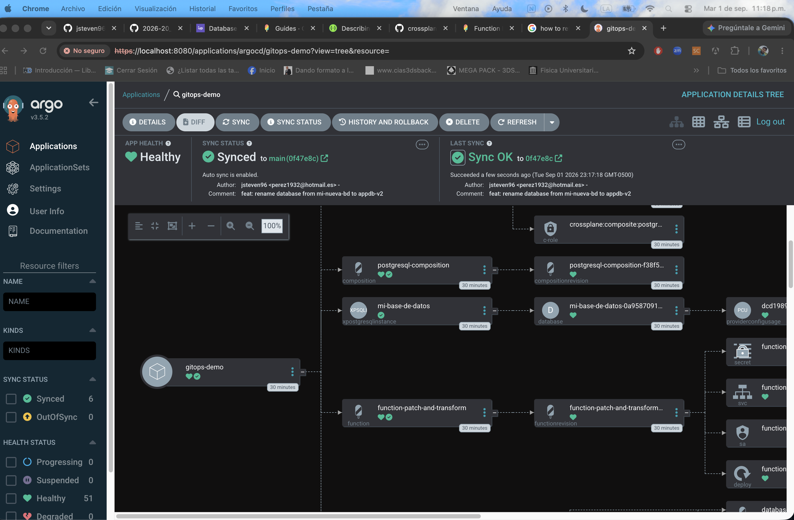
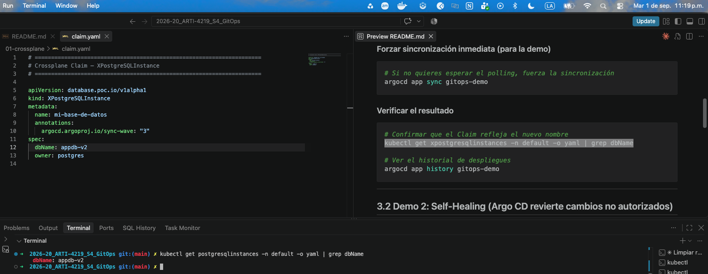
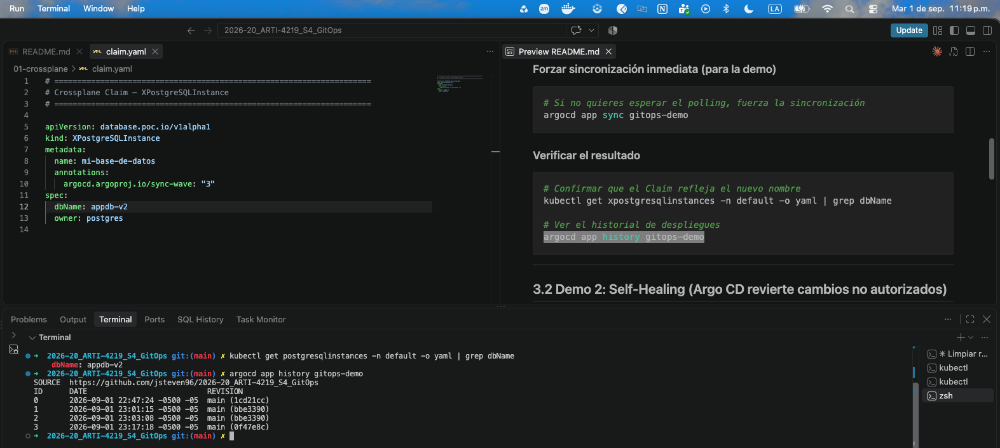
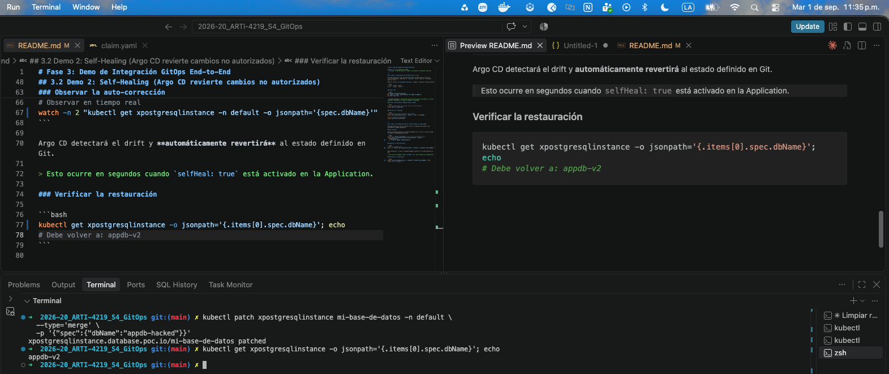

# Fase 3: Demo de Integración GitOps End-to-End

Observar el ciclo completo de GitOps:  
> `git push` → Argo CD detecta el cambio → sincroniza → Crossplane reconcilia

---

## 3.1 Demo 1: Actualización de Infraestructura vía Git

Esta demo muestra el flujo de actualización de infraestructura sin tocar el clúster directamente: modificas el `claim.yaml` en Git y Argo CD + Crossplane hacen el resto.

Edita el archivo `01-crossplane/claim.yaml` y cambia el nombre de la base de datos:

```bash
# Cambia: dbName: "appdb"
# Por:    dbName: "appdb-v2"
```

### Push a Git

```bash
git add 01-crossplane/claim.yaml
git commit -m "feat: rename database from appdb to appdb-v2"
git push origin main
```



> **Tiempo esperado:** Argo CD hace polling cada 3 minutos por defecto. Si tienes webhooks configurados, el cambio se detecta en segundos.

### Forzar sincronización inmediata (para la demo)

```bash
# Si no quieres esperar el polling, fuerza la sincronización
argocd app sync gitops-demo
```

### Verificar el resultado

```bash
# Confirmar que el Claim refleja el nuevo nombre
kubectl get xpostgresqlinstances -n default -o yaml | grep dbName

# Ver el historial de despliegues
argocd app history gitops-demo
```




---

## 3.2 Demo 2: Self-Healing (Argo CD revierte cambios no autorizados)

Esta demo muestra una de las características más poderosas de GitOps: **la resistencia a cambios manuales**.

### El escenario

Simula que alguien modificó el Claim directamente en el clúster (lo que en GitOps se llama un **configuration drift**):

```bash
# Cambiar el dbName DIRECTAMENTE en el clúster (sin pasar por Git)
kubectl patch xpostgresqlinstance mi-base-de-datos -n default \
  --type='merge' \
  -p '{"spec":{"dbName":"appdb-hacked"}}'
```

### Observar la auto-corrección

```bash
# Observar en tiempo real
watch -n 2 "kubectl get xpostgresqlinstance -n default -o jsonpath='{spec.dbName}'"
```

Argo CD detectará el drift y **automáticamente revertirá** al estado definido en Git.

> Esto ocurre en segundos cuando `selfHeal: true` está activado en la Application.

### Verificar la restauración

```bash
kubectl get xpostgresqlinstance -o jsonpath='{.items[0].spec.dbName}'; echo
# Debe volver a: appdb-v2
```


